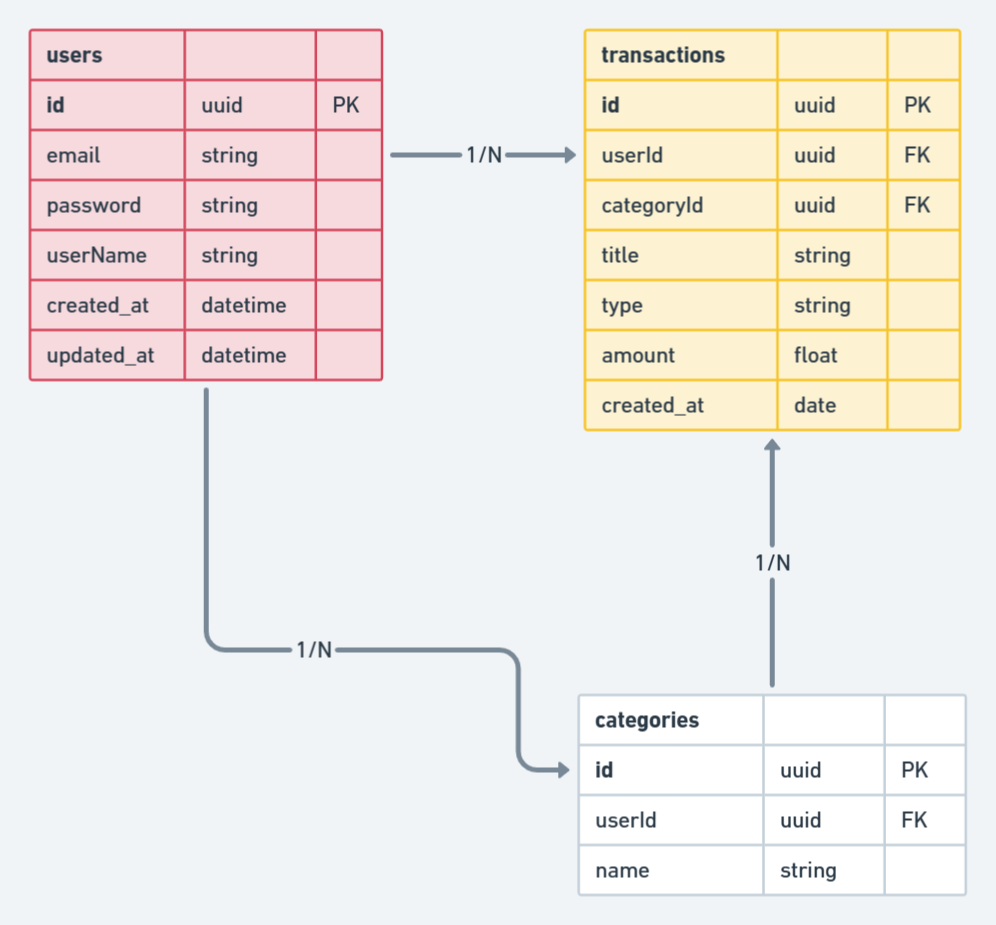

## Description

Every month it is difficult to control expenses and financial entries. With that in mind, I created a system to help me better manage this flow of inputs and outputs.

## Tecnologies

- NestJs
- PrismaORM

## Architecture

- SOLID principles

### Database initial schema

</img>

#### Next endpoints

- Create Transactions ok
- List Transactions
- Exclude Transactions
- List Categories
